# VNStock AI v3.0 — System Graph & Dependency Map

> **Mục đích**: Mô tả chi tiết toàn bộ liên kết graph của hệ thống — từ Executive Brain đến từng Agent, từng tầng xử lý, và từng kênh output. Dùng Mermaid syntax để bất kỳ AI nào cũng có thể đọc hiểu và triển khai.
> **Ngày cập nhật**: 2026-06-07

---

## 1. System Architecture Graph (Tổng thể)

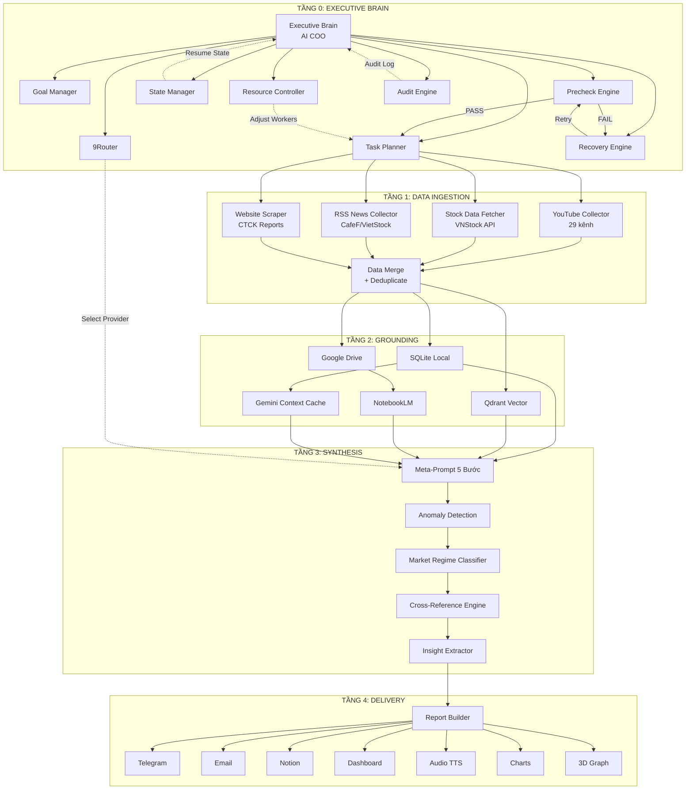

---

## 2. Executive Brain Sub-Graph (Chi tiết)

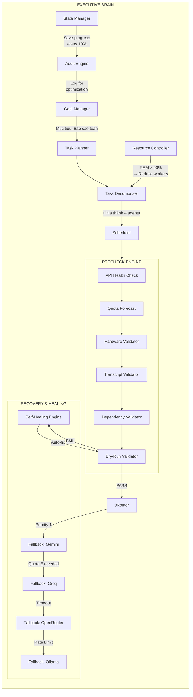

---

## 3. Data Ingestion Pipeline Graph

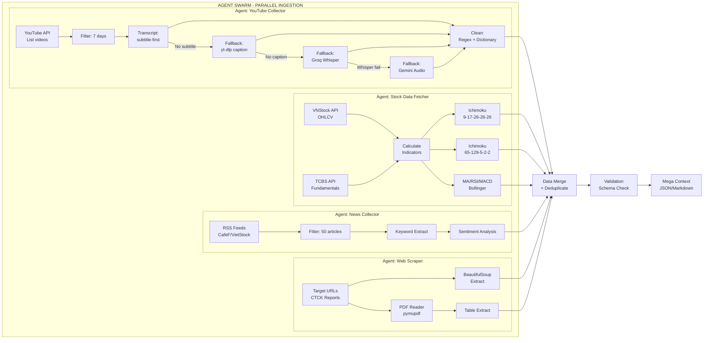

---

## 4. Grounding Layer Graph

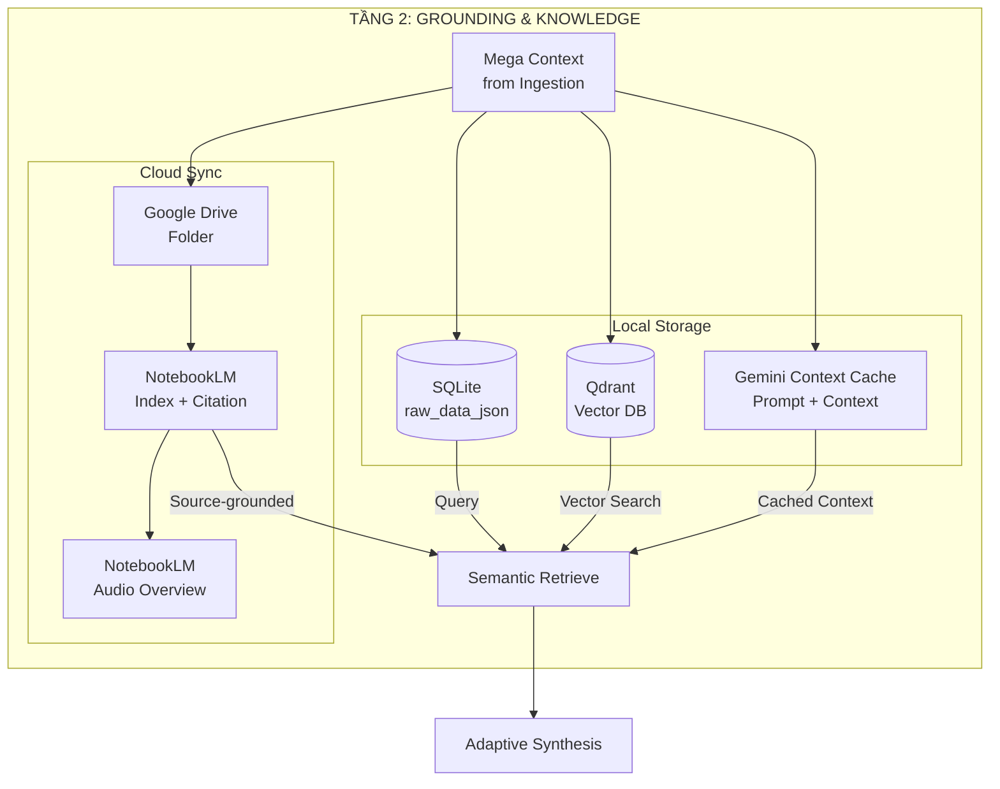

---

## 5. Adaptive Synthesis Graph

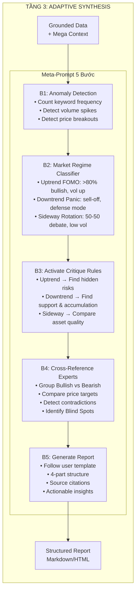

---

## 6. Report Builder & Delivery Graph

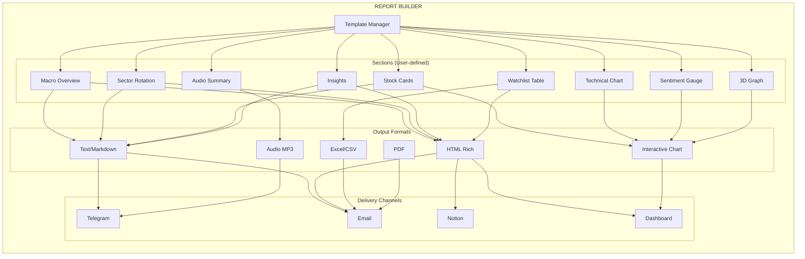

---

## 7. Recovery & Self-Healing Graph

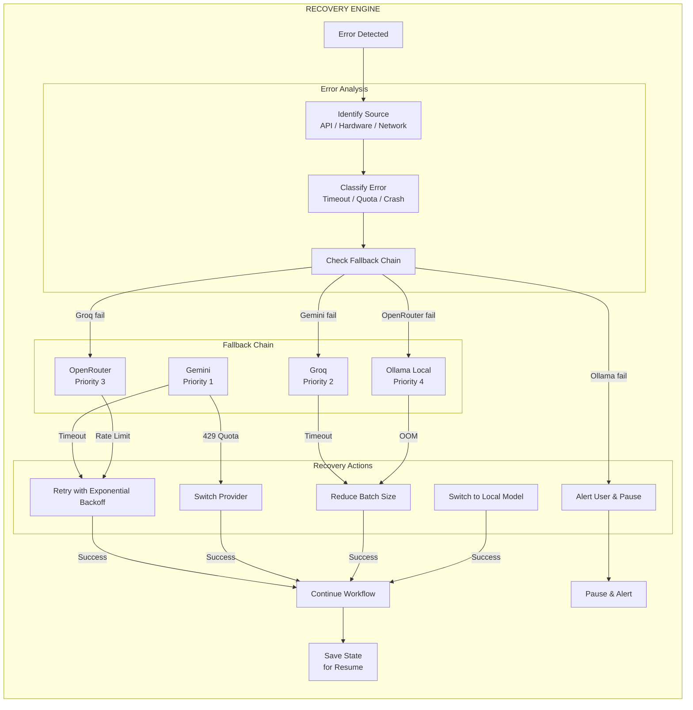

---

## 8. n8n Integration Graph

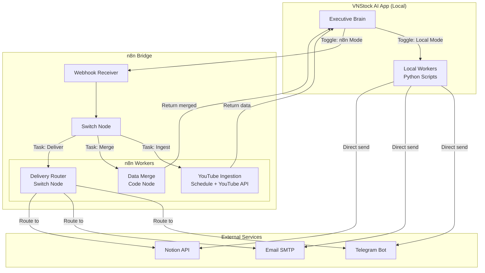

---

## 9. NotebookLM Integration Graph

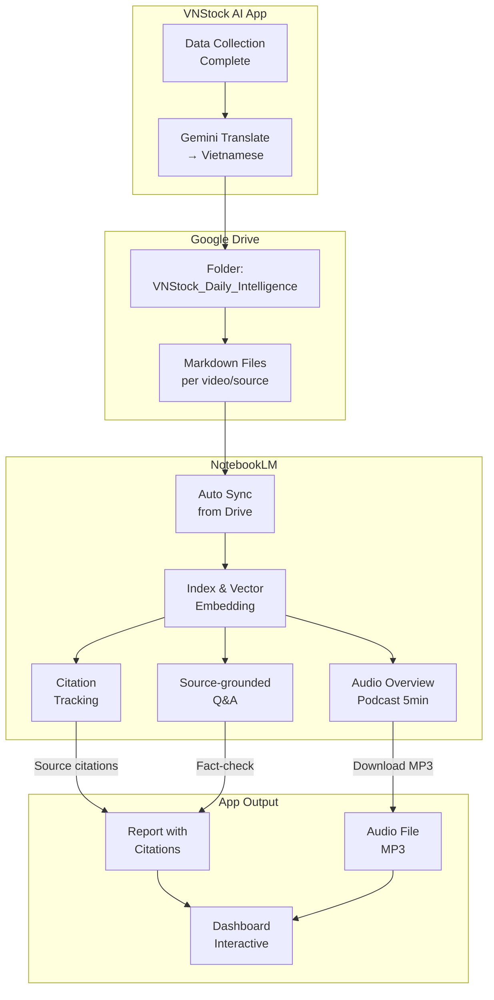

---

## 10. Database Entity Relationship Graph

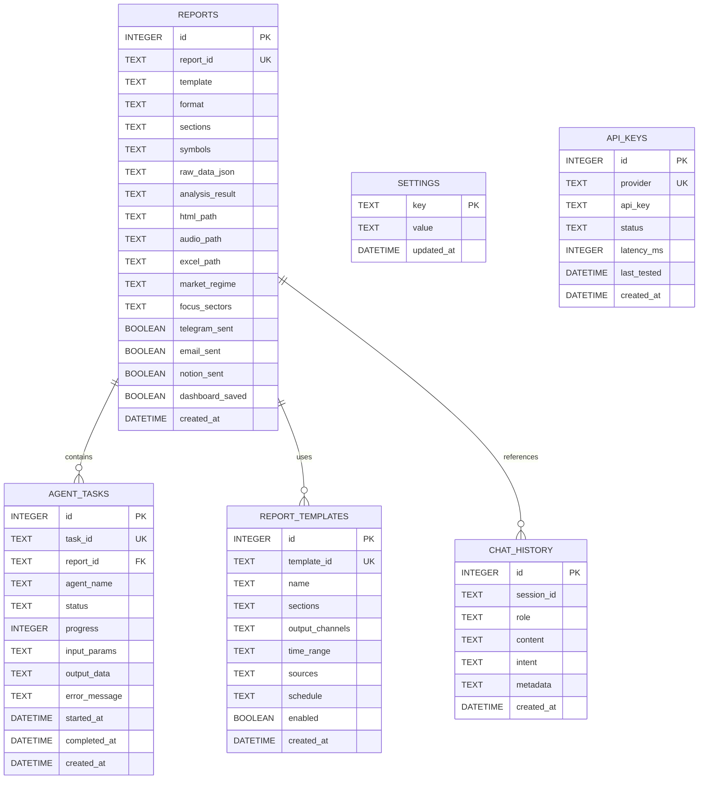

---

## 11. Component Dependency Graph

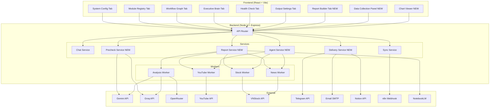

---

## 12. Runtime Flow Graph (Sequence)

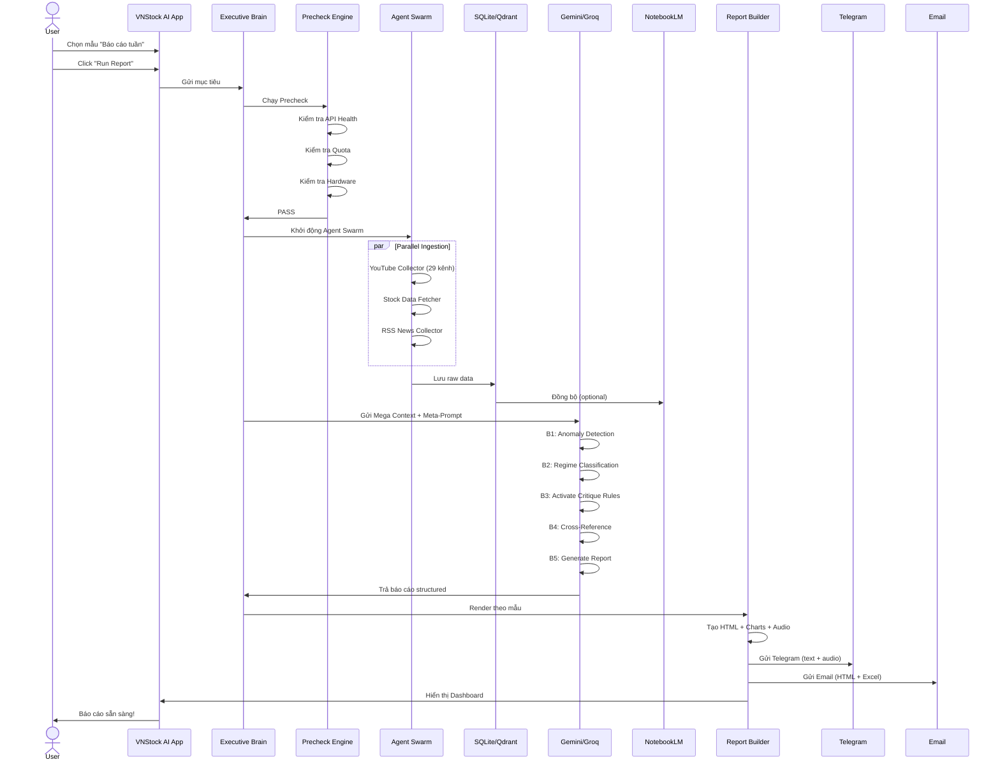

---

## 13. File Structure Graph

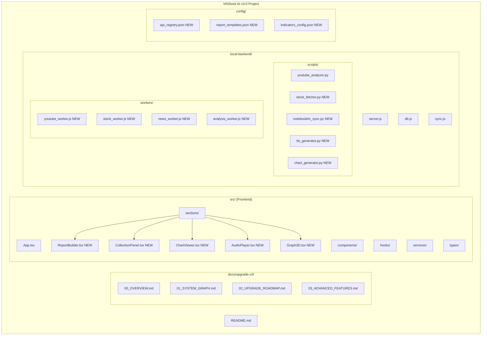

---

*File này sử dụng Mermaid syntax để mô tả graph. Có thể render bằng bất kỳ Mermaid viewer nào (GitHub, Notion, VS Code extension, hoặc mermaid.live).*
